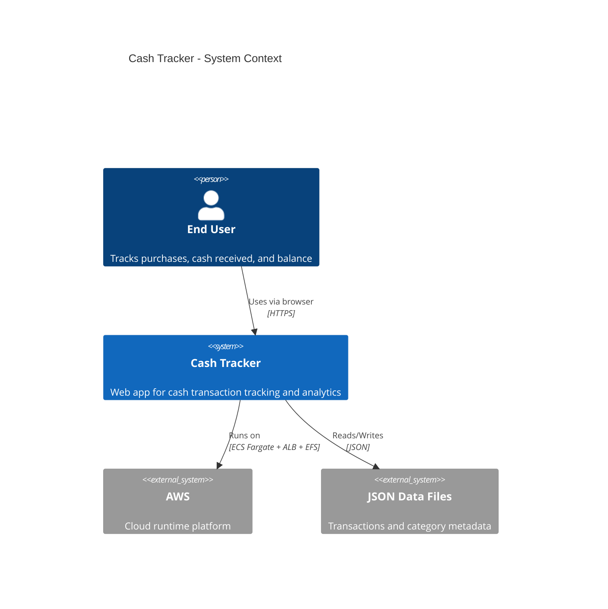
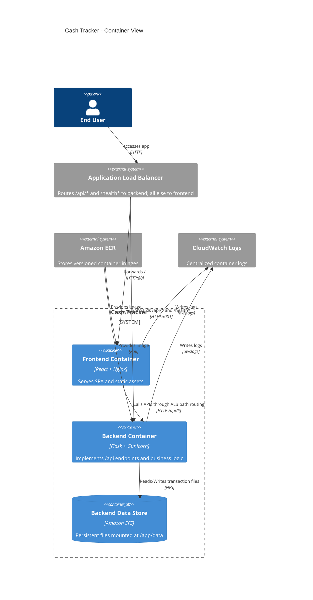
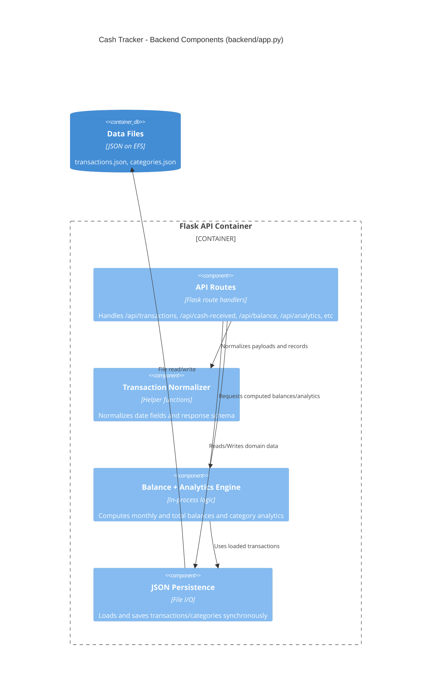

# Cash Tracker Architecture

## Purpose
This document describes the current architecture of the Cash Tracker system for local development and AWS deployment.

## Scope
- Frontend SPA in React served by Nginx
- Backend API in Flask (Gunicorn in containers)
- File-based persistence using JSON data files
- AWS runtime on ECS Fargate with ALB path routing and EFS-backed backend storage

## C4 Model

### Level 1: System Context

### Level 2: Container Diagram

### Level 3: Backend Component Diagram

## Deployment View (AWS)
- Network: one VPC, public subnets, internet gateway
- Compute: one ECS cluster with two Fargate services
- Entry: internet-facing ALB on HTTP/80
- Routing:
  - /api/* and /health* to backend target group (port 5001)
  - all other paths to frontend target group (port 80)
- Storage: backend mounts EFS at /app/data for persistent JSON files
- Registry: ECR repositories for frontend and backend images
- Logging: CloudWatch log groups for both services

## Runtime Flows
1. User opens / in browser.
2. ALB forwards request to frontend container.
3. Frontend calls /api/*.
4. ALB routes API call to backend container.
5. Backend reads/writes JSON data in EFS and returns response.

## Key Decisions
- File persistence over database for simplicity and low setup overhead
- ALB path-based routing to keep frontend/backend independently deployable
- EFS for persistence across backend task restarts/redeployments
- Immutable image tags in ECR for predictable ECS rollouts

## Risks and Constraints
- Synchronous file I/O can limit throughput under higher concurrency
- No transactional guarantees typical of RDBMS systems
- Single backend code file increases maintenance risk as complexity grows
- Public subnet design is simple but not hardened for production-grade security

## Code and Infra References
- Backend API: [backend/app.py](backend/app.py)
- Frontend app: [frontend/src/App.js](frontend/src/App.js)
- Frontend nginx config: [frontend/nginx.conf](frontend/nginx.conf)
- Terraform infra: [infra/terraform/main.tf](infra/terraform/main.tf)
- Deployment script: [deploy_aws.sh](deploy_aws.sh)
